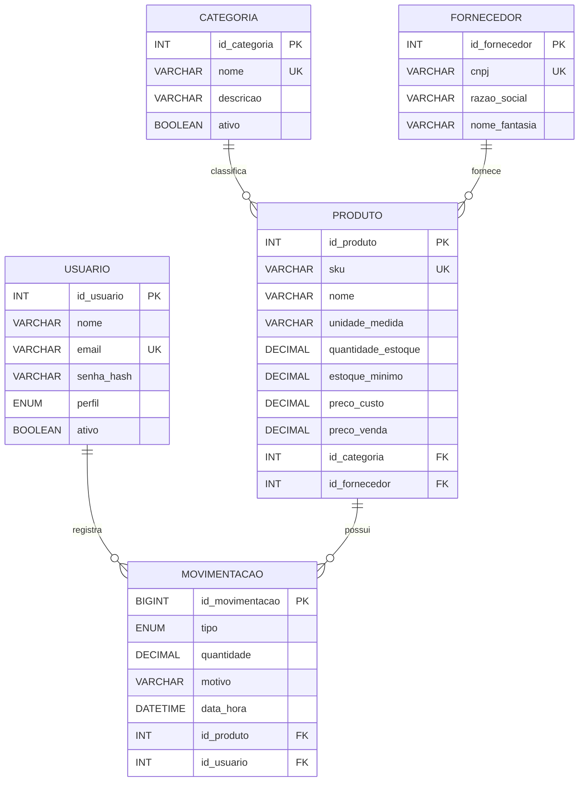

# DER - Diagrama Entidade-Relacionamento

```mermaid
erDiagram
    USUARIO ||--o{ MOVIMENTACAO : registra
    PRODUTO ||--o{ MOVIMENTACAO : possui
    CATEGORIA ||--o{ PRODUTO : classifica
    FORNECEDOR ||--o{ PRODUTO : fornece

    USUARIO {
        INT id_usuario PK
        VARCHAR nome
        VARCHAR email UK
        VARCHAR senha_hash
        ENUM perfil
        BOOLEAN ativo
    }

    CATEGORIA {
        INT id_categoria PK
        VARCHAR nome UK
        VARCHAR descricao
        BOOLEAN ativo
    }

    FORNECEDOR {
        INT id_fornecedor PK
        VARCHAR cnpj UK
        VARCHAR razao_social
        VARCHAR nome_fantasia
    }

    PRODUTO {
        INT id_produto PK
        VARCHAR sku UK
        VARCHAR nome
        VARCHAR unidade_medida
        DECIMAL quantidade_estoque
        DECIMAL estoque_minimo
        DECIMAL preco_custo
        DECIMAL preco_venda
        INT id_categoria FK
        INT id_fornecedor FK
    }

    MOVIMENTACAO {
        BIGINT id_movimentacao PK
        ENUM tipo
        DECIMAL quantidade
        VARCHAR motivo
        DATETIME data_hora
        INT id_produto FK
        INT id_usuario FK
    }
```
